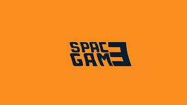

# Space Game

SpaceGame is my first project which available on Google Play.
This project was created for learn C#, Unity and used plugins.

* [Required](#required)
* [Technologies](#technologies)
* [Programming rules](#programming-rules)
* [Plugins](#plugins)
* [Version](#version)
* [Next](#next)
* [Status](#status)
* [Sources](#sources)

## Required
Systems: Android (from 4.3 to the highest version);
Free space: 30 MB.

## Technologies
- C#, LINQ to XML, XML
- Microsoft Visual Studio 2017,
- Unity Engine 2018.1.6.f1,
- GIMP 2 (for create graphics).

## Programming rules
I try to apply programming principles such as:
- DRY, 
- KISS.

## Plugins
- Unity Ads,
- Unity Purchaser,
- SunShine Android Native Share.

## Version
Rev: 1.04

## Next
- PVM for alliance,
- PVP System,

## Status
Already refactoring, optimizing the code.
In the future I would like to add a PVP, PVM system.

## Sources
If you would like to play or test the SpaceGame, you can download and install on own smartphone or tablet (only Android).
Google Play: https://play.google.com/store/apps/details?id=com.Lelon55.SpaceGame
Instagram: https://www.instagram.com/lelongames/
